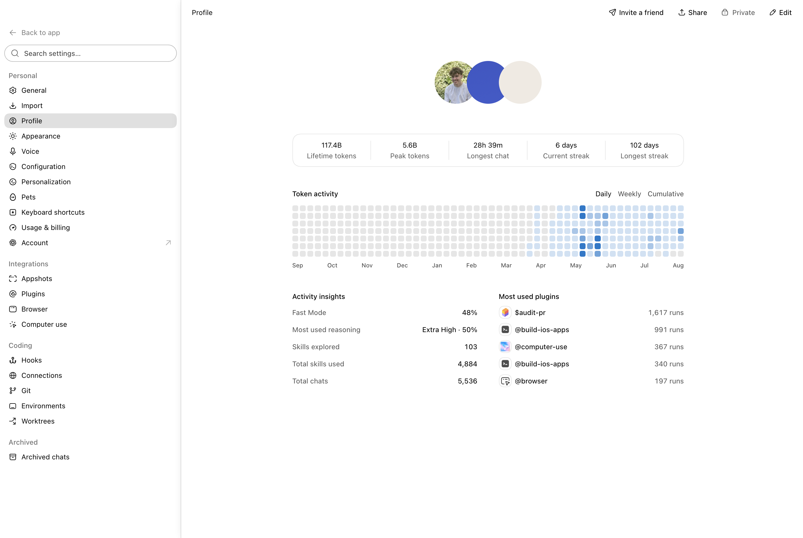

# ChatGPT Multi Account

ChatGPT Multi Account builds an independent macOS copy of the ChatGPT desktop
app that can use several ChatGPT subscriptions at once. New chats are balanced
across subscriptions, while each existing chat remains pinned to one account
to preserve conversation context and account-level caching.

The official `/Applications/ChatGPT.app` is used as build input and is never
modified. This repository contains patching source only; it does not contain or
redistribute OpenAI application binaries.

> [!WARNING]
> This is an unofficial, version-sensitive project. It is not affiliated with
> or supported by OpenAI. Review the source, build locally, and make sure your
> use complies with the terms governing each connected subscription.



## What it does

- Treats the existing `~/.codex` sign-in as the Primary subscription.
- Stores each additional sign-in in an isolated, owner-only Codex home.
- Routes new chats to the enabled subscription with the most available quota.
- Persists a thread-to-account assignment so follow-up turns reuse one account.
- Fails an exhausted thread over only when another subscription has capacity.
- Merges chat history and profile statistics across connected accounts.
- Shows pooled usage, account photos, plan names, and masked email addresses in
  the native profile menu.
- Provides account-aware Plugins, Apps, and MCP connection state.
- Keeps Appshots and Computer Use working through a separately signed helper.

```text
ChatGPT Multi.app
        │ one app-server connection
        ▼
   codex-mux
   ├── Primary  ── ~/.codex
   ├── Account 2 ─ ~/.codex-mux/accounts/…/codex-home
   └── Account 3 ─ ~/.codex-mux/accounts/…/codex-home
        │
        └── thread ID → sticky account owner
```

See [Architecture](docs/ARCHITECTURE.md) and the
[Security model](docs/SECURITY-MODEL.md) for implementation details.

## Requirements

- macOS on Apple silicon
- The official ChatGPT app at `/Applications/ChatGPT.app`
- Go 1.26 or newer
- Node.js 22.12 or newer with npm
- Xcode Command Line Tools
- A valid Apple Development or Developer ID Application signing identity

The last tested upstream build is recorded in
[Compatibility](docs/COMPATIBILITY.md). The patcher deliberately stops when an
expected upstream bundle anchor has changed.

## Build and install

```sh
git clone https://github.com/b-nnett/chatgpt-multi-account.git
cd chatgpt-multi-account
npm ci --ignore-scripts
python3 scripts/patch_app.py
open "$HOME/Applications/ChatGPT Multi.app"
```

The patcher selects the first valid Developer ID Application identity, falling
back to an Apple Development identity. To select one explicitly:

```sh
CODEX_MUX_SIGNING_IDENTITY="Developer ID Application: Example Corp (TEAMID1234)" \
  python3 scripts/patch_app.py
```

Ad-hoc signing is available only for diagnostics:

```sh
python3 scripts/patch_app.py --allow-adhoc-signing
```

Appshots and Computer Use may not work with an ad-hoc signature.

Reuse the same Apple signing team for every rebuild. Changing the team changes
the helper's designated requirement and can invalidate existing macOS privacy
consent. The patcher refuses an unexpected team change unless
`--allow-signing-team-change` is passed explicitly.

Build separately for each macOS user. The generated desktop embeds that user's
helper and socket paths and is not intended to be moved between home
directories or redistributed.

## Using multiple subscriptions

Open the profile menu at the bottom of the sidebar and choose **Add another
subscription**. Complete the displayed device-code sign-in yourself. While a
code is visible, clicking away keeps the menu open; selecting the code copies
it and opens the verification page.

The menu then shows:

1. Combined weekly usage remaining.
2. One row per connected subscription, including its photo, plan, and usage.
3. Masked email addresses that reveal only while hovered.
4. A final row for adding another subscription.

Settings → Plugins includes an account picker. Local plugin definitions are
shared, while Apps, MCP connection state, and MCP OAuth login use the selected
subscription.

Profile totals are aggregated from the counters each subscription exposes.
Because the profile API returns only a per-account unique-skill count, the same
skill explored on two subscriptions can be counted twice in the combined view.


## Updating

ChatGPT Multi disables the copied app's updater so an official update cannot
replace patched files. Update the official ChatGPT app first, check the
compatibility notes, and rebuild:

```sh
python3 scripts/patch_app.py --force
```

The previous app and Computer Use helper are moved to timestamped backup
directories under `~/.codex-mux/backups`. Quit ChatGPT Multi and its Computer
Use helper before rebuilding. Account state and credentials live outside the
app bundle and are preserved. Old backups can be deleted manually after the new
build has passed the signed-app smoke test.

## Appshots and Computer Use permissions

Grant **Accessibility** to ChatGPT Multi and **Screen & System Audio Recording**
to ChatGPT Multi Computer Use in System Settings → Privacy & Security. When
macOS offers **Quit & Reopen**, use it, then reopen ChatGPT Multi yourself if it
does not relaunch automatically.

If the expected permission row does not appear, use the plus button in System
Settings and select `~/Applications/ChatGPT Multi Computer Use.app`. Avoid
adding the official ChatGPT or Codex Computer Use row for this independent
build. Reusing the same signing team prevents duplicate or stale consent rows.

## Local data

| Path | Purpose |
| --- | --- |
| `~/.codex` | Primary credentials, conversations, and cache |
| `~/.codex-mux/state.json` | Account metadata and sticky thread ownership |
| `~/.codex-mux/accounts/<id>/codex-home` | Isolated account data |
| `~/.codex-mux/control-token` | Token for the loopback-only control API |
| `~/.codex-mux/backups` | Recoverable app/helper backups from forced rebuilds |
| `~/Library/Application Support/ChatGPT Multi` | Independent desktop profile |
| `~/Applications/ChatGPT Multi Computer Use.app` | Stable native helper |

Access and refresh tokens never leave the account's Codex home through the
project's control API. See [Security](SECURITY.md) before reporting a suspected
credential or signing issue.

## Development

```sh
npm ci --ignore-scripts
npm run check
npm run release:check
```

The renderer code and Go backend have no runtime third-party dependencies.
`@electron/asar` is a build-only dependency. Diagnostic UI routes exist only
when `CODEX_MUX_UI_TESTS=1` is present at launch and still require the local
control token.

Contributions are welcome; read [CONTRIBUTING.md](CONTRIBUTING.md). Releases are
source-only and follow [the release process](docs/RELEASING.md).

## License

Project source is available under the [MIT License](LICENSE). ChatGPT, Codex,
and the official macOS app are products of OpenAI and are not covered by this
license.
