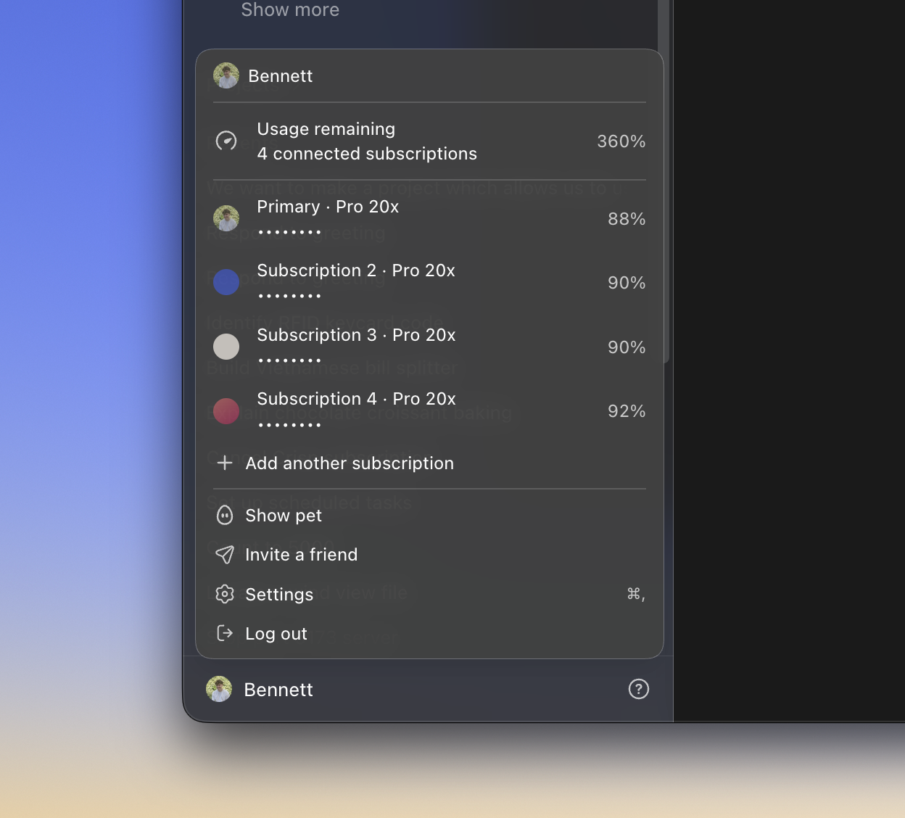
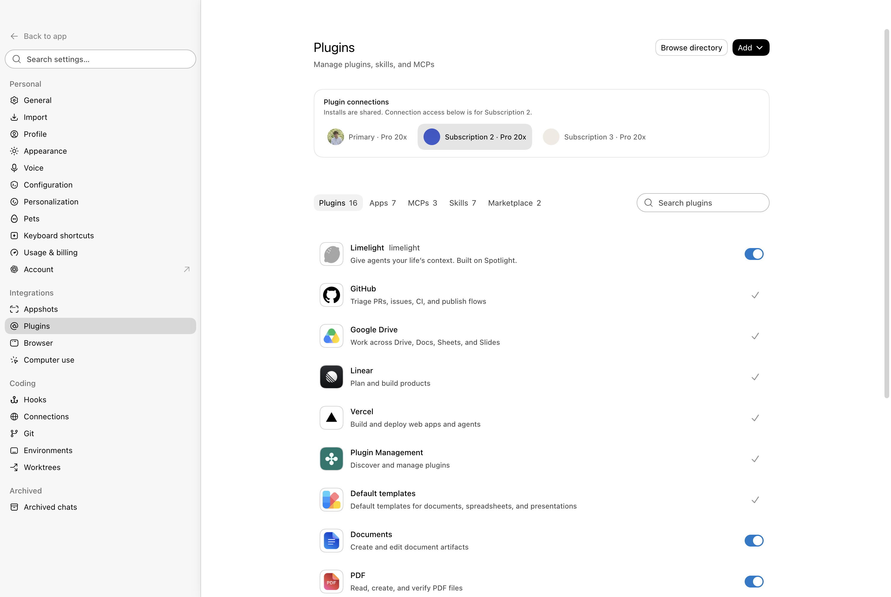

# Codex Relay

> Tài liệu tiếng Anh: [README.en.md](README.en.md)

Codex Relay cho phép sử dụng nhiều gói ChatGPT/Codex hợp lệ trong một ứng dụng
Router độc lập. Trên Windows, Relay khởi động với `codex-home` và credential
store riêng; tài khoản đang đăng nhập trong Codex gốc **không được nhập hoặc
dùng chung**. Người dùng đăng nhập tài khoản cần dùng ngay trong Relay. Primary có thể
được thay đổi ngay trong Relay; lựa chọn này được lưu riêng và không phụ thuộc
vào tài khoản đang chọn ở Codex gốc. **Primary là tài khoản điều khiển/cấu hình
mặc định, không phải khóa định tuyến:** chat mới được chia công bằng theo quota
thực tế giữa mọi tài khoản còn dùng được; chat cũ vẫn bám tài khoản đã xử lý cho
đến khi cần failover.

> [!IMPORTANT]
> Router tạo một bản sao độc lập của ứng dụng chính thức. Nó **không sửa, thay
> thế hoặc tắt** ChatGPT/Codex bản Microsoft Store hay ứng dụng ChatGPT chính
> thức trên macOS.

> [!WARNING]
> Đây là dự án không chính thức, phụ thuộc vào phiên bản ứng dụng gốc và không
> do OpenAI hỗ trợ. Hãy đọc mã nguồn, tuân thủ điều khoản của từng tài khoản và
> không dùng Router để vượt quyền truy cập hoặc giới hạn sử dụng.



## Bắt đầu nhanh trên Windows

### Cài bằng một lệnh (khuyến nghị)

Nếu máy đã có các điều kiện bên dưới, mở **PowerShell** thường (không cần mở
Admin), dán đúng một lệnh này rồi Enter:

```powershell
irm https://github.com/LightHaru/codex-relay/releases/latest/download/install-codex-relay.ps1 | iex
```

Lệnh tải script bootstrap từ **GitHub Release**, đọc manifest phát hành, kiểm
tra đúng URL gói mã nguồn và SHA-256 rồi mới giải nén/chạy bộ cài. Không cần
`git clone`; khi xong shortcut **Codex Relay** xuất hiện trên Desktop và Router
tự mở. Mã nguồn đã kiểm tra được giữ tại
`%LOCALAPPDATA%\Codex Relay Bootstrap\...` để có thể xem lại khi cần.

> Chỉ chạy lệnh này từ README/release chính thức của
> [LightHaru/codex-relay](https://github.com/LightHaru/codex-relay). Đây vẫn là
> bộ cài nguồn mở, không phải file `Setup.exe` chứa ứng dụng ChatGPT/Codex gốc.

### Cài từ mã nguồn đã tải về

Windows hiện có bộ cài bằng **nhấp đúp từ thư mục mã nguồn đã clone**, chưa phải
file `Setup.exe` tự chứa mọi thứ. Sau khi đã có mã nguồn và đủ điều kiện bên dưới,
chỉ cần mở thư mục bằng Explorer rồi nhấp đúp:

```text
Install Codex Relay.cmd
```

Ứng dụng cài đặt sẽ tự tạo shortcut **Codex Relay** trên Desktop và mở Router
sau khi cài xong. Không cần gõ lệnh để thêm tài khoản hoặc mở Router hằng ngày.

### Điều kiện cần có

- Windows x64;
- ChatGPT/Codex từ Microsoft Store đã được cài;
- Python 3;
- Go 1.26 trở lên;
- Node.js 22.12 trở lên và npm;
- kết nối Internet để tải công cụ ASAR đã khóa phiên bản.

Nếu chưa có mã nguồn, chạy một lần:

```powershell
git clone https://github.com/LightHaru/codex-relay.git
cd codex-relay
```

Sau đó mở thư mục vừa clone trong Explorer và nhấp đúp `Install Codex Relay.cmd`.

Nếu thiếu Python, Go hoặc Node, bootstrap sẽ dừng trước khi thay đổi Router.
Cài các công cụ đó từ nguồn tin cậy (ví dụ `winget` hoặc trang chính thức),
sau đó chạy lại đúng một lệnh ở trên. Bootstrap không tự âm thầm cài phần mềm
hay tự bỏ qua một phiên bản ChatGPT/Codex chưa được kiểm tra.

> Nếu thiếu `node_modules`, bộ cài tự chạy `npm ci --ignore-scripts` để lấy
> công cụ build đã khóa phiên bản. Bộ cài không tự cài Python, Go hoặc Node,
> và cũng không tự bỏ qua phiên bản ChatGPT/Codex chưa được kiểm tra tương thích.

### Bộ cài làm gì?

1. Tìm đúng ứng dụng ChatGPT/Codex đã cài từ Microsoft Store.
2. Tạo một bản Router tạm, kiểm tra xong mới thay bản Router cũ.
3. Chỉ đóng các tiến trình nằm trong thư mục Router riêng; không đóng theo tên
   chung `ChatGPT.exe`, vì vậy không đụng vào ứng dụng Microsoft Store gốc.
4. Chuyển bản Router cũ vào thư mục backup có thể khôi phục.
5. Tạo hoặc sửa shortcut Desktop và mở bản Router độc lập.

Các đường dẫn chính:

| Đường dẫn | Dùng để làm gì |
| --- | --- |
| `%LOCALAPPDATA%\Codex Relay\app` | Bản ứng dụng Relay độc lập và `routerctl.exe` |
| `%LOCALAPPDATA%\Codex Relay\Codex Relay.cmd` | File mở Relay với profile riêng |
| Desktop | Shortcut `Codex Relay.lnk` |
| `%APPDATA%\Codex Relay` | Hồ sơ desktop riêng của bản cài mới |
| `%APPDATA%\Codex Relay\codex-home` | Credential, session và cấu hình primary riêng của Relay; không dùng chung với Codex gốc |
| `%USERPROFILE%\.codex-mux` | Trạng thái Router, dữ liệu tài khoản phụ và backup; không phải thư mục credential của Codex gốc |
| `%LOCALAPPDATA%\Codex Relay Updater\router-updater.exe` | Trình cập nhật dùng cho nút **Cập nhật ngay** trong Relay |

### Nâng cấp từ bản cài đặt trước đây

Không cần đăng nhập lại. Khi cài hoặc cập nhật lên Relay, Relay tạo bản mới
ở `%LOCALAPPDATA%\Codex Relay\app`, chỉ dừng đúng tiến trình nằm trong thư mục
Router cũ, rồi chuyển bản cũ vào `%USERPROFILE%\.codex-mux\backups\...`.
Tài khoản, quota, chat đã gán, dữ liệu các tài khoản phụ và profile Electron
được giữ nguyên. Trong lần chuyển đổi đầu, Relay tiếp tục dùng profile cũ nếu
profile mới chưa tồn tại; đây là chủ ý để không đánh mất lịch sử/thiết lập
desktop. Sau khi xác nhận Relay chạy ổn, có thể xóa shortcut hoặc thư mục bản
cũ trong backup theo cách thủ công nếu muốn dọn dung lượng.

Hướng dẫn kỹ thuật chi tiết hơn nằm ở [docs/WINDOWS.md](docs/WINDOWS.md).

### Cập nhật Router ngay trong ứng dụng

Sau lần cài đầu tiên, không cần gõ lệnh để nâng cấp Router. Mỗi bản phát
hành có một tệp thông báo nhỏ trên GitHub và một gói mã nguồn kèm mã băm
SHA-256. Khi có phiên bản Router mới, trong cửa sổ Router sẽ hiện thông báo
**Cập nhật ngay**.

Khi chọn nút đó, Router sẽ tự động:

1. tải đúng gói phát hành từ GitHub;
2. kiểm tra mã băm và kiểm tra đường dẫn bên trong gói để tránh gói lỗi;
3. chờ Router hiện tại đóng, chỉ dừng các tiến trình của Router riêng;
4. chạy lại bộ cài với bản ChatGPT/Codex chính thức đang có trên máy;
5. giữ nguyên tài khoản, lịch sử chat, quyền sở hữu chat, hồ sơ desktop và
   shortcut Desktop, rồi mở bản Router mới.

Trình cập nhật nằm ngoài thư mục ứng dụng Router để có thể thay thế bản đang
chạy. Nó không sửa ứng dụng ChatGPT/Codex từ Microsoft Store, không nhận mật
khẩu hay token OAuth, và không gửi token điều khiển cục bộ. Nếu chưa có bản
phát hành mới hoặc máy không có tệp thông báo, Router sẽ không hiện banner.

Đây là cơ chế cập nhật **gói mã nguồn**, chưa phải file `Setup.exe` độc lập.
Lần cài đầu vẫn cần Python 3, Go, Node.js/npm và ứng dụng chính thức từ
Microsoft Store. Sau lần đầu, người dùng bình thường chỉ cần bấm **Update now**
trong Relay. Xem [hướng dẫn Windows đầy đủ](docs/WINDOWS.md#in-app-updates)
để biết cách xử lý khi cập nhật lỗi.

### Nếu gặp “Unable to send message — Update Agent sandbox”

Đây là lỗi thiết lập sandbox Windows, không phải lỗi quota của tài khoản. Một số
bản Codex Windows bị kẹt khi cấu hình đặt `[windows] sandbox = "elevated"`, nên
cả chat mới và chat cũ đều không gửi được lượt tiếp theo.

Router Windows tự dùng chế độ `unelevated` cho các tiến trình Router và các tài
khoản phụ. Cách này không sửa, không xóa và không đăng xuất cấu hình gốc trong
`%USERPROFILE%\.codex`; vì vậy Codex Microsoft Store vẫn giữ nguyên thiết lập
riêng của nó. Sau khi nâng cấp, chỉ cần đóng rồi mở lại shortcut **Codex
Relay** một lần. Nếu vẫn còn hộp thoại cũ, chạy lại bộ cài từ
checkout để Router thay wrapper mới, rồi mở lại Router.

## Dùng Router hằng ngày

### Tài khoản chính và tài khoản phụ

- **Primary** là tài khoản điều khiển do Router chọn. Trên Windows, Primary
  bắt đầu trong home riêng của Relay và không lấy tài khoản từ Codex gốc; người dùng
  đăng nhập nó trong Relay nếu muốn dùng. Primary vẫn giữ cấu hình chung của
  Relay và không phải điểm truy cập vào chat native của Codex gốc.
- Mỗi tài khoản thêm vào có thư mục dữ liệu Codex và thông tin xác thực riêng.
- Khi nâng cấp từ bản Router cũ, nếu state còn ghi bất kỳ tài khoản nào dùng
  `%USERPROFILE%\.codex`, Relay tự chuyển entry đó sang home riêng dưới
  `%USERPROFILE%\.codex-mux\accounts\...` và yêu cầu đăng nhập lại. Relay chỉ
  xoá liên kết chủ chat trong metadata của chính Router; file credential và
  history của Codex gốc vẫn được giữ nguyên.
- **Chat mới không bị khóa vào Primary.** Router đọc cả cửa sổ quota ngắn và
  dài, loại tài khoản đã cạn hoặc đang bị circuit breaker cô lập, giữ một phần
  quota dự phòng thấp và phân bổ bằng weighted-deficit round-robin. Con trỏ,
  deficit và reservation được lưu xuống đĩa nên restart không làm mất tính công
  bằng hoặc cấp cùng một quota cho hai lượt đang chạy.
- Relay đối chiếu hai nguồn quota cho từng tài khoản tách biệt: snapshot
  `account/rateLimits/read` của app-server và Usage native. Cờ
  `allowed`/`limit_reached` không được phép che một cửa sổ đang 100%; ngược lại,
  lỗi `usageLimitExceeded` từ một lượt thật luôn mạnh hơn cache. Circuit chỉ đưa
  tài khoản trở lại pool khi thấy kỳ reset mới có dung lượng hoặc một lượt thử
  probation đã thành công.
- Chính sách mặc định là **Balanced**: Router có thể chọn worker phù hợp cho mỗi
  lượt, nhưng lượt đầu tiên của task mới luôn ở worker đã tạo task. Từ lượt kế
  tiếp, Router chỉ có thể đổi worker tại ranh giới sau khi lượt trước đã hoàn
  tất và rollout chuẩn đã tồn tại. Menu Relay còn
  có **Sticky** (giữ worker nếu còn dùng được) và **Rotate** (đổi worker sau mỗi
  lượt hoàn tất). Không chính sách nào được chuyển tài khoản giữa một command,
  approval, hook hay tool đang chạy.
- Mỗi task có một `generation`, tối đa một `TurnAttempt` đang hoạt động và một
  bản lịch sử chuẩn trong **Relay Memory**. `Relay Controller` chỉ điều khiển cấu
  hình; `Current Task Route` mới là tài khoản thực thi lượt hiện tại.
- Nếu task có **Goal**, Relay đọc state Goal thật từ app-server nguồn và khôi
  phục/kiểm tra objective, trạng thái và ngân sách token trên worker đích trước
  khi commit đổi owner. Goal bị `usageLimited` sẽ trở lại `active` khi sang
  worker đã xác nhận còn quota; phần ngân sách còn lại được giữ an toàn. Nếu
  chính app-server tự tạo lượt Goal tiếp theo mà không có `turn/start` từ UI,
  Relay vẫn nhận diện lỗi quota ở `turn/completed`, chuyển tại ranh giới bền
  vững đó và không phát lại command/tool của lượt cũ.
- Nếu worker đang xử lý hết hạn mức trước khi tạo tác dụng phụ, Router chuyển
  task sang tài khoản phù hợp bằng journal `PREPARED → COPIED → RESUMED →
  COMMITTED`. Relay checkpoint rollout vào kho chuẩn, kiểm tra SHA-256/prefix,
  chỉ chép suffix mới khi có thể, materialize nguyên tử sang worker đích, resume
  thành công rồi mới tăng generation và đổi owner. History nguồn không bị sửa.
  Quy tắc này áp dụng cho chat cũ đã thuộc Relay
  nhưng chưa có mapping; Relay tìm rollout trong các home Relay trước khi
  chuyển sang tài khoản còn quota. Nếu state cũ còn trỏ tới rollout trong
  `sessions` của Codex gốc, khi người dùng mở đúng chat đó trong Relay, Relay chỉ chép
  một file rollout vào home riêng của tài khoản được chọn; credential/cấu hình
  không được nhập và file nguồn không bị sửa.
- Nếu quota lỗi sau khi command/file/tool đã bắt đầu, Router **không phát lại
  tự động**. Task chuyển sang `recovery required`; sau khi xem lại kết quả người
  dùng có thể xác nhận trong panel Relay để cho phép lượt tiếp theo. Cách này
  ngăn command hoặc thay đổi file bị chạy hai lần.
- Nếu lỗi là **“Selected model is at capacity”**, Router giữ nguyên model và
  toàn bộ payload của lượt chat, thử lại tối đa 3 lần với chờ ngắn tăng dần trên
  chính tài khoản đó. Nó không tự đổi model và không trừ quota tài khoản khác
  chỉ vì model đang bận.

Nói ngắn gọn: một task có chung bộ nhớ Relay nhưng mỗi lượt chỉ có đúng một
worker. Router có thể đổi worker liền mạch giữa các lượt đã hoàn tất; không chạy
song song hai tài khoản trên cùng task và không replay tác dụng phụ chưa rõ kết
quả.

### Chính sách định tuyến và theo dõi task

Mở menu tài khoản Relay để xem hai dòng riêng biệt:

- **Relay Controller**: tài khoản điều khiển cấu hình/UI chung.
- **Current Task Route**: worker, generation và trạng thái recovery của task
  đang mở.

Ba nút **Sticky**, **Balanced** và **Rotate** đổi chính sách toàn Relay. API local
tương ứng gồm `GET /v1/router/status`, `GET /v1/thread-route`, `GET
/v1/routing/decisions`, `PUT /v1/routing/policy` và stream `/v1/events`; tất cả
đều cần token cài đặt và chỉ bind loopback.

#### Routing Inspector: biết task thật sự chạy qua tài khoản nào

Trong một task Relay, ngay phía trên composer có dòng **Đang chạy qua**. Dòng
này hiển thị worker thực sự của lượt hiện tại, không phải Primary/Relay
Controller. Chọn **Chi tiết định tuyến** để mở panel nằm trong luồng nội dung;
panel không che task, không chèn vào sidebar và không thay Settings shell.

Các nhãn có ý nghĩa riêng:

- **Tài khoản đang sở hữu task** giữ canonical generation hiện tại.
- **Tài khoản thực thi hiện tại** đang xử lý logical turn; khi không có lượt
  đang chạy, Relay ghi rõ **Hiện không có lượt nào đang chạy**.
- **Lượt hoàn tất gần nhất qua** là worker hoàn thành lượt trước.
- **Quota gần nhất ghi nhận ở** chỉ được xác nhận khi snapshot mới hơn cho thấy
  quota giảm đo được.
- **Tài khoản dự kiến (chưa chạy)** là preview cho lượt kế tiếp. Việc mở hoặc
  refresh panel không tăng dispatch count, không đổi cursor/deficit, không tạo
  reservation và không làm scheduler chọn khác đi.

Mục **Vì sao chọn tài khoản** hiển thị score, quota đã xác nhận và reason code
được chuẩn hóa. Ví dụ: `selected_highest_score` là điểm khả dụng cao nhất;
`eligible_lower_score` vẫn có thể dùng nhưng điểm thấp hơn;
`skipped_depleted`, `skipped_cooldown`, `skipped_open_circuit`,
`skipped_disconnected`, `skipped_disabled`, `skipped_unknown_quota` và
`skipped_stale_quota` giải thích vì sao một worker bị bỏ qua. Balanced có thể
dùng một tài khoản nhiều lượt liên tiếp khi quota, deficit và reservation của
tài khoản đó tạo score tốt hơn; đây không phải chế độ luân phiên cứng.

Mục **Dòng thời gian định tuyến** ghi event ID, thời gian, generation, worker,
reservation, completion, quota attribution và các phase handoff. Một handoff
thành công có nguồn → đích, reason và `COMMITTED`; nếu lỗi xảy ra sau
command/tool/hook/approval hoặc sửa file, Relay dừng ở `recovery required` và
không phát lại mù quáng. Timeline chỉ lưu hash request và lý do đã làm sạch;
không lưu prompt, Goal objective, nội dung file, tool arguments, token hay
đường dẫn tuyệt đối.

> `500% / 500%` nghĩa là năm subscription biệt lập đang cung cấp tối đa 500
> điểm phần trăm **dung lượng định tuyến**. Đây không phải một subscription
> OpenAI 500%, không gộp hóa đơn/số dư, và mỗi request vẫn chạy bằng đúng một
> subscription.

### Chọn Primary và quản lý tài khoản

1. Mở menu tài khoản ở cuối thanh bên của **Codex Relay**.
2. Bấm **Account settings**.
3. Bấm **Set as Primary** ở tài khoản đã kết nối để đổi tài khoản ưu tiên. Việc
   này lưu Primary riêng của Router, sau đó Router tự khởi động lại các phiên
   Codex con của chính Router để thay đổi có hiệu lực ngay. Tài khoản và cửa
   sổ Codex gốc không bị đăng xuất hoặc khởi động lại.
4. Muốn gỡ tài khoản phụ, bấm **Remove** rồi xác nhận. Router không cho xóa
   Primary hiện tại; hãy chọn tài khoản khác làm Primary trước. Nếu tài khoản
   đang giữ chat, hộp xác nhận sẽ nói rõ số chat bị ảnh hưởng và chỉ xóa liên kết
   định tuyến, không xóa file history gốc.

Mục **Pool quota dùng chung** cộng phần quota đã đọc được từ các tài khoản:
`5` subscription đầy đủ hiển thị `500% / 500%`; nếu tổng phần còn lại là
`155%` thì hiển thị `155% / 500%`, không lấy trung bình thành `31%`. Nếu một
tài khoản chưa trả quota, giao diện vẫn hiển thị tổng phần đã biết và ghi
**Updating quota…** hoặc **Quota unavailable**; nó không biến dữ liệu thiếu thành
`0%` hay hiện dấu `–` gây hiểu nhầm.

Mỗi dòng tài khoản hiển thị tên hồ sơ ChatGPT (`display name`, rồi đến username
hoặc email khi cần), gói đang dùng và nhãn Router. Dòng quota của chính tài
khoản đó cũng hiển thị thời gian hồi của từng cửa sổ hạn mức, ví dụ `Reset 5h:
1h 20m`. Di chuột lên dòng để xem mốc giờ đầy đủ theo máy đang sử dụng. Nếu ChatGPT chưa
trả thời gian reset, Router ghi rõ là chưa có dữ liệu thay vì tự đoán.

Trang native `Settings` → `Usage & billing` vẫn là trang gốc và vẫn giữ nguyên
sidebar, bố cục, menu điều hướng cùng các thao tác billing của Codex. Relay chỉ
chèn thêm panel **Pool quota dùng chung** vào đúng phần nội dung của
trang con này; panel không dùng `position: fixed`, không phủ lên Settings và
không tạo mục mới trong sidebar. Thông tin chính là pool cộng dồn; chi tiết
từng worker nằm trong mục **Chẩn đoán worker** có thể mở ra, gồm plan, credits,
các cửa sổ quota, thời điểm reset, reset credit và trạng thái lỗi. Mỗi worker
vẫn dùng home/credential Relay riêng. Pool không gộp token, hóa đơn hay reset
credit của OpenAI; nó chỉ cung cấp một bộ lập lịch và bộ nhớ task chung.

Mở **Account settings** trong menu Relay vẫn cho phép quản lý Primary, gỡ
subscription và xem nhanh **Usage limit resets** theo từng tài khoản. Nút
**Use reset** trong cả panel `Usage & billing` lẫn Account settings đều gọi
đúng subscription đang đứng trên thẻ; không thể trừ reset credit của tài khoản
khác. Các nút plan, credits, thanh toán và hủy gói tiếp tục do trang native
quản lý.

Trong **Account settings**, mỗi tài khoản đã kết nối có phần **Usage limit
resets** riêng. Phần này hiển thị số reset còn dùng được/số reset áp dụng được,
tiêu đề, trạng thái, thời điểm cấp, hạn dùng, thời điểm đã đổi và toàn bộ chi
tiết phản hồi của từng reset credit. Dữ liệu được lấy qua home và credential
tách biệt của tài khoản tương ứng; không tạo số liệu tổng hợp giả.

### Dùng chat cũ với Router

Có thể tiếp tục các **chat cũ đã thuộc Relay**, không chỉ chat mới. Mở chat đó
từ thanh bên của **Codex Relay** rồi gửi tin nhắn tiếp theo tại cửa sổ Router.
Nếu tài khoản Relay đang sở hữu chat đã hết hạn mức, Relay sao chép history cục
bộ cần thiết sang kho tách biệt của tài khoản còn quota, sau đó tiếp tục đúng
cuộc hội thoại bằng tài khoản này.

Chat được tạo trong Codex gốc trước khi tách dữ liệu vẫn thuộc Codex gốc. Nếu
người dùng mở đúng chat đó trong Relay và Relay còn biết `threadId`, Relay chỉ đọc
đúng một file rollout cũ rồi sao chép bản sao vào `CODEX_HOME` riêng của tài
khoản Relay; Relay không đọc `auth.json`/`config.toml`, không khởi chạy child
trên home của Codex gốc và không sửa hoặc xóa file nguồn. Chat chỉ có trong
Codex gốc không tự động bị quét hay nhập hàng loạt.

Router không thể chặn một lượt đã gửi từ cửa sổ **Codex gốc** vì app gốc không
kết nối với Router. Không cần tắt Codex gốc; lượt muốn Relay chuyển quota phải
được gửi từ chính cửa sổ **Codex Relay**.

Relay hỗ trợ history ở cả `sessions` và `archived_sessions`, đồng thời hiểu
đường dẫn rollout tuyệt đối hoặc tương đối mà các phiên bản Codex khác nhau
trả về. Vì vậy chat đã lưu trữ vẫn có thể được chuyển sang tài khoản còn
quota; file history gốc không bị sửa.

Nếu state cũ của Router vẫn trỏ tới rollout nằm trong thư mục `sessions` của
Codex gốc, việc mở đúng chat đó trong Relay cũng thực hiện di trú một file
theo cách chỉ đọc. Relay chép file vào kho riêng của tài khoản được chọn,
không chép credential/cấu hình và giữ nguyên rollout nguồn.

### Thêm tài khoản phụ trên Windows

1. Mở **Codex Relay** từ shortcut Desktop.
2. Mở menu tài khoản ở cuối thanh bên.
3. Bấm **Add another subscription**.
4. Router mở trang đăng nhập ChatGPT chính thức trong trình duyệt mặc định
   (Chrome, Edge hoặc trình duyệt mặc định). Đây là luồng OAuth chuẩn của
   Codex; callback localhost vẫn do app-server riêng của từng subscription
   nhận, không đi qua Codex gốc.
5. Đăng nhập trên trang chính thức. Nếu trình duyệt đang nhớ tài khoản khác,
   chọn **Use another account** hoặc đổi tài khoản ngay trên trang đó.
6. Nếu đã đóng trang đăng nhập, bấm **Open secure sign-in** để mở lại; nếu
   không muốn tiếp tục, bấm **Cancel sign-in** để hủy tài khoản đang chờ.
   Relay lưu lại ý định đăng nhập đang chờ, vì vậy mở lại Relay sẽ khôi phục
   dòng **Waiting for sign-in** đúng với phiên đang dang dở. Tài khoản bị ngắt
   kết nối nhưng không có phiên chờ thật sẽ hiện **Not connected**, không giả
   làm như trình duyệt vẫn đang đăng nhập.
7. Khi callback thành công, hộp xác nhận tự đóng và Router hiện thông báo kết
   nối thành công. Nếu OAuth báo lỗi, tài khoản chờ vẫn còn để thử lại;
   Router không tự xóa tài khoản chỉ vì trang web báo lỗi.

Router Windows không hiển thị device code và không hỏi mật khẩu. Nó chỉ chuyển
URL HTTPS thuộc `chatgpt.com` hoặc `auth.openai.com` sang trình duyệt mặc định;
việc đăng nhập, callback localhost và lưu thông tin xác thực do tiến trình
Codex app-server chính chủ của subscription xử lý. Relay không đọc mật khẩu,
code callback hay token OAuth.

> Lưu ý: Router có thể bảo đảm cookie, local storage và cache của cửa sổ này
> là mới. Nó không và không nên xóa đăng nhập một lần (SSO), passkey hoặc nhận
> dạng do Windows, Google, Microsoft hay Apple quản lý. Nếu trang chính thức
> tự chọn một tài khoản từ SSO, hãy chọn **Use another account** ngay trên trang
> đó.

### Hủy đăng nhập đang chờ

Nếu không muốn thêm tài khoản nữa, bấm **Cancel sign-in** trong hộp thoại. Router
sẽ hủy quy trình đăng nhập và xóa đúng tài khoản phụ chưa kết nối, vì vậy không
còn dòng **Waiting for sign-in** bị sót lại.

Nếu đăng nhập vừa hoàn tất ngay trước lúc bấm hủy, Router giữ lại tài khoản đã
kết nối để tránh xóa nhầm. Không thể dùng thao tác này để xóa Primary.

> Giao diện macOS hiện vẫn dùng device code cho đến khi phần giao diện đó được
> chuyển đổi riêng.

### Khi tất cả tài khoản đều hết hạn mức

Nếu không còn tài khoản nào có hạn mức, Router hiển thị một thông báo tổng hợp
về hạn mức và lần reset tiếp theo đã biết. Nó không lặp lại vô ích yêu cầu trên
tài khoản đã cạn hạn mức.

## Profile, Plugins và reset hạn mức



### Mục `Profile`

Mở `Settings` (hoặc `Cài đặt`) → `Profile`.

Ban đầu, `Profile` hiển thị số liệu tổng hợp của các tài khoản đã kết nối với
các avatar xếp chồng lên nhau. Bấm vào avatar của một tài khoản để xem thông
tin và số liệu riêng của tài khoản đó. Bấm lại avatar đã chọn để quay về chế độ
tổng hợp.

### Mục `Plugins`

Mở `Settings` (hoặc `Cài đặt`) → `Plugins`.

Ở đầu trang có bộ chọn tài khoản. Cấu hình plugin và MCP được dùng chung, còn
`Apps`, trạng thái kết nối và thao tác đăng nhập OAuth sẽ sử dụng tài khoản
đang chọn.

### Reset hạn mức theo từng tài khoản

Mở **Account settings** trong menu tài khoản. Mỗi subscription đã kết nối có
một thẻ **Usage limit resets** theo kiểu giao diện native. Thẻ hiển thị số lượt
đang có, hạn dùng và trạng thái của từng reset; nút **Use reset** chỉ gọi đúng
subscription đang đứng trên thẻ, sau đó tải lại số dư. Một tài khoản dùng reset
không làm trừ lượt của tài khoản khác.

Trang native `Settings` → `Usage & billing` giữ nguyên bố cục của Codex gốc,
nhưng panel Relay được đặt trong đúng content column của trang con. Nếu bản
Codex cũ từng hiện **Oops, an error has occurred**, cập nhật Relay rồi mở lại
shortcut. Relay lấy Usage qua credential tách biệt của từng subscription; khi
dịch vụ cục bộ tạm lỗi, Relay fail closed và không rơi sang tài khoản của
Codex gốc.

Nếu mở `Settings` → `Usage` mà bản cũ từng hiện **Oops, an error has occurred**,
cập nhật Relay rồi mở lại shortcut. Relay mới lấy Usage qua credential tách biệt
của Router thay vì session browser của Microsoft Store; nếu API cục bộ tạm lỗi,
panel sẽ báo tài khoản không khả dụng và không đọc nhầm quota của Codex gốc.

## An toàn dữ liệu

| Vị trí | Nội dung |
| --- | --- |
| `%APPDATA%\Codex Relay\codex-home` | Credential, cuộc hội thoại và cấu hình Primary riêng của Relay trên Windows |
| `~/.codex` | Dữ liệu native của Codex gốc; Relay chỉ có thể đọc một rollout cũ đã được yêu cầu để di trú, không đọc credential/cấu hình và không sửa/xóa thư mục này |
| `~/.codex-mux/state.json` | Metadata tài khoản và tài khoản đang xử lý từng cuộc hội thoại |
| `~/.codex-mux/accounts/<id>/codex-home` | Thư mục dữ liệu Codex riêng của từng tài khoản phụ |
| `~/.codex-mux/control-token` | Token ngẫu nhiên cho dịch vụ điều khiển cục bộ |
| `~/.codex-mux/backups` | Bản Router cũ để khôi phục khi cần |
| `%APPDATA%\Codex Relay` | Hồ sơ riêng của bản cài Relay mới trên Windows |

- Dịch vụ điều khiển chỉ lắng nghe tại `127.0.0.1` và dùng token ngẫu nhiên
  256-bit cho các API riêng.
- Router không trả mã OAuth qua API và không cố ý ghi mã này vào log.
- Repository không có endpoint telemetry của Router và không phân phối binary
  đã patch của OpenAI.
- Cấu hình plugin/MCP được đồng bộ từ Primary. Vì vậy dữ liệu bí mật ghi trực tiếp bên
  trong cấu hình MCP dùng chung có thể xuất hiện trong thư mục tài khoản phụ;
  các thư mục này không phải ranh giới bí mật tuyệt đối cho cấu hình dùng chung.

Trên Windows, đăng nhập, đăng xuất hoặc xóa tài khoản trong Codex gốc không
thay đổi danh sách tài khoản của Codex Relay. Relay dùng `codex-home` riêng và
credential store dạng file riêng; người dùng cần đăng nhập tài khoản đó trong Relay
nếu muốn dùng nó ở Relay.

Đọc [SECURITY.md](SECURITY.md) và
[docs/SECURITY-MODEL.md](docs/SECURITY-MODEL.md) trước khi báo lỗi bảo mật.

## Khi ChatGPT/Codex chính thức cập nhật

Nếu chỉ có bản Router mới, hãy dùng nút **Cập nhật ngay** trong ứng dụng; Router
sẽ tự tải, kiểm tra, khởi động lại và mở lại. Khi chính ChatGPT/Codex chính
thức cập nhật, không ghi đè trực tiếp lên bản Router đang hoạt động. Trước
tiên, xem [docs/COMPATIBILITY.md](docs/COMPATIBILITY.md). Hiện Router đã giữ
hồ sơ cho các gói `26.810.7004.0`, `26.818.2441.0`, `26.818.3698.0` và
`26.818.4152.0`, `26.818.5229.0`, `26.818.5345.0`, `26.818.8289.0`. Nếu phiên bản
ứng dụng gốc đã được kiểm tra, chạy lại bộ cài:

| Nền tảng | Cách tạo lại Router |
| --- | --- |
| Windows | Bấm **Update now** nếu Relay có banner; nếu cần tạo lại sau Store update, chạy lại lệnh bootstrap một dòng hoặc nhấp đúp `Install Codex Relay.cmd` |
| macOS | Chạy `./install.sh` hoặc `python3 scripts/patch_app.py --force` |

Router sẽ dừng an toàn nếu phát hiện phiên bản gốc hoặc giao diện chưa được
kiểm tra, thay vì cài dở dang. Hãy giữ bản backup cho đến khi bản mới chạy ổn.

## Cài trên macOS Apple silicon

Trên macOS, Router tạo ứng dụng độc lập tại:

- `~/Applications/Codex Relay.app`
- `~/Applications/Codex Relay Computer Use.app`

Máy cần có ứng dụng ChatGPT chính thức ở `/Applications/ChatGPT.app`, Python
3, Go 1.26+, Node.js 22.12+/npm, Xcode Command Line Tools và certificate ký
ứng dụng Apple phù hợp.

```sh
git clone https://github.com/LightHaru/codex-relay.git
cd codex-relay
./install.sh
```

Giữ cùng Apple signing team giữa các lần tạo lại Router để không mất quyền
Privacy đã cấp. Bản ký ad-hoc chỉ dùng để chẩn đoán; `Computer Use` và
`Appshots` có thể không hoạt động đầy đủ với kiểu ký này.

Khi cần, cấp quyền cho Router độc lập — không phải ChatGPT chính thức — trong
`System Settings → Privacy & Security`:

| Quyền | Ứng dụng |
| --- | --- |
| `Accessibility` | Codex Relay |
| `Screen & System Audio Recording` | Codex Relay Computer Use |

## Phát triển và kiểm tra

```sh
npm ci --ignore-scripts
npm run check
npm run release:check
```

Trên Windows, có thể chạy riêng kiểm tra bộ cài/công cụ patch:

```powershell
python scripts/test_patch_windows.py
```

Bộ kiểm tra gồm Go test/vet, kiểm tra JavaScript và UI, công cụ patch Python,
bộ cài Windows, các điểm tương thích giao diện và thông tin phát hành. Xem
[docs/ARCHITECTURE.md](docs/ARCHITECTURE.md) và
[docs/SHARED-MEMORY-ROUTER.md](docs/SHARED-MEMORY-ROUTER.md) nếu cần chi tiết kỹ thuật về bộ
điều phối nhiều tài khoản.

## Giới hạn hiện tại

- Đây là công cụ chỉ phát hành mã nguồn. Chưa có Windows `Setup.exe` độc lập,
  chưa đóng gói sẵn Node/Go/Python runtime và không phân phối lại binary
  ChatGPT/Codex.
- Bản Windows là bản port thử nghiệm, chỉ hoạt động với các phiên bản ứng dụng
  gốc đã được kiểm tra trong `docs/COMPATIBILITY.md`.
- Bản cập nhật từ ChatGPT/Codex có thể yêu cầu review tương thích và cập nhật
  phần patch trước khi cài lại; bản chưa có hồ sơ sẽ dừng an toàn.
- `Computer Use` và `Appshots` vẫn là tính năng riêng của macOS.
- Lần lấy lịch sử tổng hợp ban đầu giới hạn 500 cuộc hội thoại cho mỗi tài
  khoản.
- Một tài khoản chỉ được Router chọn khi hợp lệ, bật, đã kết nối và còn hạn
  mức.
- Chỉ manifest được tạo từ đúng `app.asar` đã review mới bật handoff xuyên tài
  khoản. Nếu profile thiếu hoặc không nhận diện, UI vẫn cho thấy policy người
  dùng đã chọn nhưng **policy hiệu lực** tự hạ về Sticky; Router không thử copy
  history/resume mạo hiểm.
- Chưa profile nào chứng minh resume an toàn cho một lượt đang làm dở. Relay có
  thể đổi worker giữa hai lượt đã hoàn tất và retry lỗi quota trước output/tác
  dụng phụ; sau command, tool, hook, approval hoặc sửa file thì task bắt buộc
  vào `recovery required`, không phát lại mù quáng.
- Test tự động chỉ dùng app-server giả và home tạm. Live E2E Windows cần người
  vận hành cho phép rõ ràng vì có thể phải rebuild/restart Relay đang cài và có
  nguy cơ tiêu quota thật.

## Ghi công, giấy phép và đóng góp

Xin cảm ơn [Bennett Blackham (b-nnett)](https://github.com/b-nnett/codex-subscription-router),
tác giả dự án nền tảng. Repository này giữ nguyên giấy phép MIT và các thông
báo cần thiết, đồng thời bổ sung phần Windows, bộ cài, định tuyến fair-share
theo quota và tài liệu liên quan.

- Đọc [NOTICE.md](NOTICE.md) để xem đầy đủ ghi công và giới hạn phân phối
  OpenAI binaries.
- Mã nguồn dùng [MIT License](LICENSE). ChatGPT, Codex và các ứng dụng desktop
  chính thức là sản phẩm của OpenAI, không nằm trong giấy phép của repository
  này.
- Đọc [CONTRIBUTING.md](CONTRIBUTING.md) trước khi đóng góp.
- Làm theo [SECURITY.md](SECURITY.md) khi báo lỗi liên quan credential, signing
  hoặc dịch vụ cục bộ.
